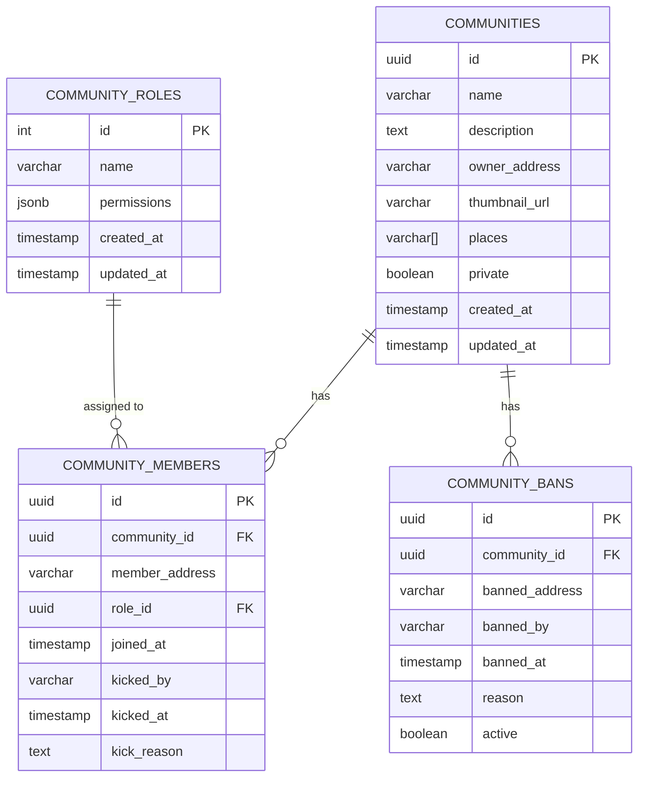

# EA Social Service

[](https://coveralls.io/github/decentraland/social-service-ea)

A microservice that handles social interactions (friendships) for Decentraland, built using the Well Known Components architecture pattern.

## Table of Contents

- [🌟 Features](#-features)
- [🏗 Architecture](#-architecture)
  - [Component-Based Architecture](#component-based-architecture)
  - [Database Design](#database-design)
    - [Friends](#friends)
    - [Communities](#communities)
  - [Friendship Flow Diagrams](#friendship-flow-diagrams)
  - [Block System Flow](#block-system-flow)
- [🚀 Getting Started](#-getting-started)
  - [Prerequisites](#prerequisites)
  - [Local Development](#local-development)
  - [Environment Variables](#environment-variables)
- [🧪 Testing](#-testing)
  - [Test Coverage](#test-coverage)
- [🔄 CI/CD](#-ci/cd)
  - [Deployment Environments](#deployment-environments)

## 🌟 Features

- Friendship management (requests, accepts, rejects, cancellations)
- Real-time friend status updates
- Mutual friends discovery
- Online status tracking
- Integration with Archipelago for peer synchronization
- User blocking system

## 🏗 Architecture

### Component-Based Architecture

This service follows the Well Known Components pattern, where each component is a self-contained unit with a clear interface. The main components are:

- **Database (PostgreSQL)**: Stores friendship relationships and actions
- **Cache (Redis)**: Handles temporary information, real-time status, and frequently accessed data
- **RPC Server**: Manages client-server RPC communication following the [Protocol definition](https://github.com/decentraland/protocol/blob/main/proto/decentraland/social_service/v2/social_service_v2.proto)
- **PubSub**: Handles real-time updates
- **Archipelago Stats**: Integrates with Decentraland's peer discovery system
- **Peer Tracking**: Monitors online status of users through the NATS messaging system
- **Catalyst Client**: Fetches profiles from the Catalyst Lambdas API
- **Peers Synchronization**: Synchronizes peers with the Archipelago Stats service and store them in Redis

### Database Design

#### Friends


The database schema supports:

- Bidirectional friendships
- Action history tracking
- User blocking system
- Metadata for requests
- Optimized queries with proper indexes

#### Communities



See migrations for details: [migrations](./src/migrations)

### Friendship Flow Diagrams


### Block System Flow


## 🚀 Getting Started

### Prerequisites

- Node.js v18.20.4
- Docker and Docker Compose
- PostgreSQL
- Redis

### Local Development

1. Clone the repository
2. Install dependencies:

```bash
yarn install
```

3. Start the development environment:

```bash
docker-compose up -d
```

4. Run migrations:

```bash
yarn migrate up
```

5. Run the service:

```bash
yarn dev
```

### Environment Variables

Key environment variables needed:

- `REDIS_HOST`: URL of the Redis instance
- `RPC_SERVER_PORT`: Port of the RPC server
- `PG_COMPONENT_PSQL_CONNECTION_STRING`: URL of the PostgreSQL instance
- `ARCHIPELAGO_STATS_URL`: URL of the Archipelago Stats service
- `NATS_URL`: URL of the NATS instance
- `CATALYST_LAMBDAS_URL_LOADBALANCER`: URL of the Catalyst Lambdas Load Balancer
- `PEER_SYNC_INTERVAL_MS`: Interval for peer synchronization
- `PEERS_SYNC_CACHE_TTL_MS`: Cache TTL for peer synchronization

See `.env.default` for all available options.

## 🧪 Testing

The project uses Jest for testing. Run tests with:

```bash
yarn test
```

### Test Coverage

Coverage reports are generated in the `/coverage` directory and uploaded to Coveralls.

## 🔄 CI/CD

The project uses GitHub Actions for:

- Continuous Integration
- Docker image building
- Automated deployments to dev/prod environments
- Dependency management with Dependabot

### Deployment Environments

- **Development**: Automatic deployments on main branch
- **Production**: Manual deployments via GitHub releases
