# Database Schema Documentation

This document describes the database schema for the Social Service EA. The schema uses PostgreSQL and is managed through migrations located in `src/migrations/`.

## Tables Overview

The database contains the following active tables:
1. **`friendships`** - Stores friendship relationships between users
2. **`friendship_actions`** - Tracks history of friendship actions (requests, accepts, rejects)
3. **`blocks`** - Stores user blocking relationships
4. **`social_settings`** - User privacy and social preferences
5. **`communities`** - User-created communities/groups
6. **`community_members`** - Community membership and roles
7. **`community_bans`** - Banned members from communities
8. **`community_places`** - Places associated with communities
9. **`community_posts`** - Posts within communities
10. **`community_post_likes`** - Likes on community posts
11. **`community_requests`** - Join/leave requests for communities
12. **`private_voice_chats`** - Temporary private voice chat sessions
13. **`referral_progress`** - Referral program tracking
14. **`referral_progress_viewed`** - Referral progress viewed counts

---

## Database Schema Diagram

```mermaid
erDiagram
    friendships {
        UUID id PK "Friendship ID"
        VARCHAR address_requester "Requester address"
        VARCHAR address_requested "Requested address"
        BOOLEAN is_active "Active status"
        TIMESTAMP created_at "Creation time"
        TIMESTAMP updated_at "Update time"
    }
    
    friendship_actions {
        UUID id PK "Action ID"
        UUID friendship_id "Friendship reference"
        VARCHAR action "Action type"
        VARCHAR acting_user "User who performed action"
        JSON metadata "Action metadata"
        TIMESTAMP timestamp "Action time"
    }
    
    blocks {
        UUID id PK "Block ID"
        VARCHAR blocker_address "Blocker address"
        VARCHAR blocked_address "Blocked address"
        TIMESTAMP blocked_at "Block time"
    }
    
    social_settings {
        VARCHAR address PK "User address"
        VARCHAR private_messages_privacy "Privacy setting"
        VARCHAR blocked_users_messages_visibility "Visibility setting"
    }
    
    communities {
        UUID id PK "Community ID"
        VARCHAR name "Community name"
        TEXT description "Description"
        VARCHAR owner_address "Owner address"
        BOOLEAN private "Private flag"
        BOOLEAN active "Active status"
        BOOLEAN unlisted "Unlisted flag"
        TIMESTAMP created_at "Creation time"
        TIMESTAMP updated_at "Update time"
    }
    
    community_members {
        UUID id PK "Member ID"
        UUID community_id FK "Community reference"
        VARCHAR member_address "Member address"
        VARCHAR role "Member role"
        TIMESTAMP joined_at "Join time"
    }
    
    community_bans {
        UUID id PK "Ban ID"
        UUID community_id FK "Community reference"
        VARCHAR banned_address "Banned address"
        VARCHAR banned_by "Banner address"
        TIMESTAMP banned_at "Ban time"
        TEXT reason "Ban reason"
        BOOLEAN active "Active status"
    }
    
    community_places {
        UUID id PK "Place ID"
        UUID community_id FK "Community reference"
        VARCHAR place_type "Place type"
        JSONB position "Position data"
        VARCHAR world_name "World name"
        VARCHAR added_by "Added by address"
        TIMESTAMP added_at "Added time"
    }
    
    community_posts {
        UUID id PK "Post ID"
        UUID community_id FK "Community reference"
        VARCHAR author_address "Author address"
        TEXT content "Post content"
        TIMESTAMP created_at "Creation time"
    }
    
    community_post_likes {
        UUID post_id FK "Post reference"
        VARCHAR user_address "User address"
        TIMESTAMP liked_at "Like time"
    }
    
    community_requests {
        UUID id PK "Request ID"
        UUID community_id FK "Community reference"
        VARCHAR member_address "Member address"
        VARCHAR status "Request status"
        VARCHAR type "Request type"
        TIMESTAMP created_at "Creation time"
        TIMESTAMP updated_at "Update time"
    }
    
    private_voice_chats {
        UUID id PK "Chat ID"
        VARCHAR caller_address "Caller address"
        VARCHAR callee_address "Callee address"
        TIMESTAMP created_at "Creation time"
        TIMESTAMP updated_at "Update time"
        TIMESTAMP expires_at "Expiration time"
    }
    
    referral_progress {
        UUID id PK "Progress ID"
        TEXT referrer "Referrer address"
        TEXT invited_user "Invited user address"
        TEXT status "Status"
        BIGINT signed_up_at "Sign up timestamp"
        BOOLEAN tier_granted "Tier granted"
        BIGINT tier_granted_at "Tier granted timestamp"
        BIGINT created_at "Creation timestamp"
        BIGINT updated_at "Update timestamp"
    }
    
    referral_progress_viewed {
        TEXT referrer PK "Referrer address"
        INT invites_accepted_viewed "Viewed count"
        BIGINT updated_at "Update timestamp"
    }
    
    friendships ||--o{ friendship_actions : "has actions"
    communities ||--o{ community_members : "has members"
    communities ||--o{ community_bans : "has bans"
    communities ||--o{ community_places : "has places"
    communities ||--o{ community_posts : "has posts"
    communities ||--o{ community_requests : "has requests"
    community_posts ||--o{ community_post_likes : "has likes"
```

**Relationship Notes:**
- **Foreign Keys**: `community_members.community_id` → `communities.id`, `community_bans.community_id` → `communities.id`, `community_places.community_id` → `communities.id`, `community_posts.community_id` → `communities.id`, `community_requests.community_id` → `communities.id`, `community_post_likes.post_id` → `community_posts.id`
- **Logical References**: `friendship_actions.friendship_id` references `friendships.id` (not a foreign key)
- **Cascade Deletes**: All community-related tables cascade on delete when a community is deleted

---

## Table: `friendships`

Stores friendship relationships between users.

### Columns

| Column | Type | Nullable | Description |
|--------|------|----------|-------------|
| `id` | UUID | NOT NULL | **Primary Key**. Unique friendship identifier. |
| `address_requester` | VARCHAR | NOT NULL | Ethereum address of the user who sent the friend request. |
| `address_requested` | VARCHAR | NOT NULL | Ethereum address of the user who received the friend request. |
| `is_active` | BOOLEAN | NULL | Whether the friendship is active (accepted). Defaults to `false`. |
| `created_at` | TIMESTAMP | NULL | Timestamp when the friendship record was created. Defaults to `now()`. |
| `updated_at` | TIMESTAMP | NULL | Timestamp when the friendship record was last updated. Defaults to `now()`. |

### Indexes

- **Primary Key**: `id`
- **Index**: On `address_requester` and `address_requested` for efficient lookups

### Business Rules

1. Addresses are normalized to lowercase
2. A friendship is active when `is_active = true` (accepted)
3. Friendships are bidirectional in application logic

---

## Table: `friendship_actions`

Tracks history of all friendship-related actions (requests, accepts, rejects).

### Columns

| Column | Type | Nullable | Description |
|--------|------|----------|-------------|
| `id` | UUID | NOT NULL | **Primary Key**. Unique action identifier. |
| `friendship_id` | UUID | NOT NULL | Reference to the friendship record. |
| `action` | VARCHAR | NOT NULL | Action type (e.g., `"request"`, `"accept"`, `"reject"`, `"cancel"`). |
| `acting_user` | VARCHAR | NOT NULL | Ethereum address of the user who performed the action. |
| `metadata` | JSON | NULL | Additional metadata about the action. |
| `timestamp` | TIMESTAMP | NULL | Timestamp when the action occurred. Defaults to `now()`. |

### Indexes

- **Primary Key**: `id`
- **Index**: On `friendship_id` for efficient history queries

### Business Rules

1. Provides audit trail for all friendship state changes
2. Used for debugging and analytics

---

## Table: `blocks`

Stores user blocking relationships.

### Columns

| Column | Type | Nullable | Description |
|--------|------|----------|-------------|
| `id` | UUID | NOT NULL | **Primary Key**. Unique block identifier. |
| `blocker_address` | VARCHAR | NOT NULL | Ethereum address of the user who blocked. |
| `blocked_address` | VARCHAR | NOT NULL | Ethereum address of the blocked user. |
| `blocked_at` | TIMESTAMP | NULL | Timestamp when the block was created. Defaults to `now()`. |

### Indexes

- **Primary Key**: `id`
- **Index**: On `blocked_address` for efficient blocked user lookups
- **Unique Index**: On `(blocker_address, blocked_address)` to prevent duplicate blocks

### Business Rules

1. Blocking is unidirectional (blocker blocks blocked)
2. Blocked users cannot see blocker's content or send messages

---

## Table: `social_settings`

Stores user privacy and social preferences.

### Columns

| Column | Type | Nullable | Description |
|--------|------|----------|-------------|
| `address` | VARCHAR(42) | NOT NULL | **Primary Key**. Ethereum address of the user. |
| `private_messages_privacy` | VARCHAR | NOT NULL | Privacy setting for private messages. Defaults to `"ONLY_FRIENDS"`. Valid values: `"ONLY_FRIENDS"`, `"EVERYONE"`, `"NO_ONE"`. |
| `blocked_users_messages_visibility` | VARCHAR | NOT NULL | Visibility setting for blocked users' messages. Defaults to `"SHOW_MESSAGES"`. Valid values: `"SHOW_MESSAGES"`, `"HIDE_MESSAGES"`. |

### Indexes

- **Primary Key**: `address`

### Constraints

- Check constraint on `private_messages_privacy` to ensure valid enum values
- Check constraint on `blocked_users_messages_visibility` to ensure valid enum values

### Business Rules

1. One settings record per user address
2. Settings control message visibility and privacy

---

## Table: `communities`

Stores user-created communities/groups.

### Columns

| Column | Type | Nullable | Description |
|--------|------|----------|-------------|
| `id` | UUID | NOT NULL | **Primary Key**. Unique community identifier. |
| `name` | VARCHAR | NOT NULL | Community name. |
| `description` | TEXT | NOT NULL | Community description. |
| `owner_address` | VARCHAR | NOT NULL | Ethereum address of the community owner. |
| `private` | BOOLEAN | NOT NULL | Whether the community is private. Defaults to `false`. |
| `active` | BOOLEAN | NOT NULL | Whether the community is active. Defaults to `true`. |
| `unlisted` | BOOLEAN | NOT NULL | Whether the community is unlisted. Defaults to `false`. |
| `created_at` | TIMESTAMP | NOT NULL | Timestamp when the community was created. Defaults to `now()`. |
| `updated_at` | TIMESTAMP | NOT NULL | Timestamp when the community was last updated. Defaults to `now()`. |

### Indexes

- **Primary Key**: `id`
- **Index**: On `owner_address` for efficient owner queries

### Business Rules

1. Communities can be public or private
2. Unlisted communities are not shown in public listings
3. Active communities are visible and functional

---

## Table: `community_members`

Stores community membership and roles.

### Columns

| Column | Type | Nullable | Description |
|--------|------|----------|-------------|
| `id` | UUID | NOT NULL | **Primary Key**. Unique member record identifier. |
| `community_id` | UUID | NOT NULL | **Foreign Key** to `communities.id`. Cascade delete. |
| `member_address` | VARCHAR | NOT NULL | Ethereum address of the member. |
| `role` | VARCHAR | NOT NULL | Member role (e.g., `"owner"`, `"admin"`, `"member"`). |
| `joined_at` | TIMESTAMP | NOT NULL | Timestamp when the member joined. Defaults to `now()`. |

### Indexes

- **Primary Key**: `id`
- **Index**: On `community_id` for efficient member lookups
- **Index**: On `member_address` for user's communities queries

### Business Rules

1. One membership record per user per community
2. Roles determine permissions within the community
3. Deleted communities cascade delete all members

---

## Table: `community_bans`

Stores banned members from communities.

### Columns

| Column | Type | Nullable | Description |
|--------|------|----------|-------------|
| `id` | UUID | NOT NULL | **Primary Key**. Unique ban identifier. |
| `community_id` | UUID | NOT NULL | **Foreign Key** to `communities.id`. Cascade delete. |
| `banned_address` | VARCHAR | NOT NULL | Ethereum address of the banned user. |
| `banned_by` | VARCHAR | NOT NULL | Ethereum address of the user who issued the ban. |
| `banned_at` | TIMESTAMP | NOT NULL | Timestamp when the ban was issued. Defaults to `now()`. |
| `reason` | TEXT | NULL | Reason for the ban. |
| `active` | BOOLEAN | NOT NULL | Whether the ban is active. Defaults to `true`. |

### Indexes

- **Primary Key**: `id`
- **Index**: On `community_id` for efficient ban lookups
- **Index**: On `banned_address` for user ban queries

### Business Rules

1. Active bans prevent users from accessing the community
2. Bans can be deactivated without deleting the record
3. Deleted communities cascade delete all bans

---

## Table: `community_places`

Stores places associated with communities.

### Columns

| Column | Type | Nullable | Description |
|--------|------|----------|-------------|
| `id` | UUID | NOT NULL | **Primary Key**. Unique place identifier. |
| `community_id` | UUID | NOT NULL | **Foreign Key** to `communities.id`. Cascade delete. |
| `place_type` | VARCHAR | NOT NULL | Type of place (e.g., `"world"`, `"scene"`). |
| `position` | JSONB | NOT NULL | Position data (coordinates, etc.). |
| `world_name` | VARCHAR | NOT NULL | Name of the world/place. |
| `added_by` | VARCHAR | NOT NULL | Ethereum address of the user who added the place. |
| `added_at` | TIMESTAMP | NOT NULL | Timestamp when the place was added. Defaults to `now()`. |

### Indexes

- **Primary Key**: `id`
- **Index**: On `community_id` for efficient place lookups

### Business Rules

1. Communities can have multiple associated places
2. Deleted communities cascade delete all places

---

## Table: `community_posts`

Stores posts within communities.

### Columns

| Column | Type | Nullable | Description |
|--------|------|----------|-------------|
| `id` | UUID | NOT NULL | **Primary Key**. Unique post identifier. Auto-generated. |
| `community_id` | UUID | NOT NULL | **Foreign Key** to `communities.id`. Cascade delete. |
| `author_address` | VARCHAR | NOT NULL | Ethereum address of the post author. |
| `content` | TEXT | NOT NULL | Post content. |
| `created_at` | TIMESTAMP | NOT NULL | Timestamp when the post was created. Defaults to `now()`. |

### Indexes

- **Primary Key**: `id`
- **Index**: On `community_id` for efficient post listing
- **Index**: On `(community_id, created_at)` for chronological queries

### Business Rules

1. Posts belong to a single community
2. Deleted communities cascade delete all posts

---

## Table: `community_post_likes`

Stores likes on community posts.

### Columns

| Column | Type | Nullable | Description |
|--------|------|----------|-------------|
| `post_id` | UUID | NOT NULL | **Foreign Key** to `community_posts.id`. Cascade delete. |
| `user_address` | VARCHAR | NOT NULL | Ethereum address of the user who liked the post. |
| `liked_at` | TIMESTAMP | NOT NULL | Timestamp when the like was created. Defaults to `now()`. |

### Indexes

- **Composite Primary Key**: `(post_id, user_address)` - One like per user per post
- **Index**: On `post_id` for efficient like counting

### Business Rules

1. Users can like a post only once
2. Deleted posts cascade delete all likes

---

## Table: `community_requests`

Stores join/leave requests for communities.

### Columns

| Column | Type | Nullable | Description |
|--------|------|----------|-------------|
| `id` | UUID | NOT NULL | **Primary Key**. Unique request identifier. |
| `community_id` | UUID | NOT NULL | **Foreign Key** to `communities.id`. Cascade delete. |
| `member_address` | VARCHAR | NOT NULL | Ethereum address of the requesting user. |
| `status` | VARCHAR | NOT NULL | Request status (e.g., `"pending"`, `"accepted"`, `"rejected"`). Defaults to `"pending"`. |
| `type` | VARCHAR | NOT NULL | Request type (e.g., `"join"`, `"leave"`). |
| `created_at` | TIMESTAMP | NOT NULL | Timestamp when the request was created. Defaults to `now()`. |
| `updated_at` | TIMESTAMP | NOT NULL | Timestamp when the request was last updated. Defaults to `now()`. |

### Indexes

- **Primary Key**: `id`
- **Index**: On `(community_id, type, status)` for efficient request filtering
- **Index**: On `(community_id, status)` for status-based queries
- **Index**: On `(member_address, type, status)` for user request queries
- **Index**: On `(community_id, member_address, type, status)` for composite queries

### Business Rules

1. Tracks join and leave requests for communities
2. Status transitions from `pending` to `accepted` or `rejected`
3. Deleted communities cascade delete all requests

---

## Table: `private_voice_chats`

Stores temporary private voice chat sessions.

### Columns

| Column | Type | Nullable | Description |
|--------|------|----------|-------------|
| `id` | UUID | NOT NULL | **Primary Key**. Unique chat identifier. |
| `caller_address` | VARCHAR | NOT NULL | Ethereum address of the caller. |
| `callee_address` | VARCHAR | NOT NULL | Ethereum address of the callee. |
| `created_at` | TIMESTAMP | NOT NULL | Timestamp when the chat was created. Defaults to `now()`. |
| `updated_at` | TIMESTAMP | NOT NULL | Timestamp when the chat was last updated. Defaults to `now()`. |
| `expires_at` | TIMESTAMP | NOT NULL | Timestamp when the chat expires. Must be greater than `now()`. |

### Indexes

- **Primary Key**: `id`
- **Index**: On `caller_address` for caller queries
- **Index**: On `callee_address` for callee queries

### Constraints

- Check constraint: `expires_at > now()` - Expiration must be in the future

### Business Rules

1. Only one active private voice chat per user (enforced in application)
2. Chats expire automatically based on `expires_at`
3. Used for temporary peer-to-peer voice connections

---

## Table: `referral_progress`

Tracks referral program progress.

### Columns

| Column | Type | Nullable | Description |
|--------|------|----------|-------------|
| `id` | UUID | NOT NULL | **Primary Key**. Unique progress identifier. |
| `referrer` | TEXT | NOT NULL | Ethereum address of the referrer. |
| `invited_user` | TEXT | NOT NULL | Ethereum address of the invited user. |
| `status` | TEXT | NOT NULL | Referral status. |
| `signed_up_at` | BIGINT | NULL | Timestamp (milliseconds) when the user signed up. |
| `tier_granted` | BOOLEAN | NOT NULL | Whether a tier was granted. Defaults to `false`. |
| `tier_granted_at` | BIGINT | NULL | Timestamp (milliseconds) when tier was granted. |
| `created_at` | BIGINT | NOT NULL | Timestamp (milliseconds) when the record was created. |
| `updated_at` | BIGINT | NOT NULL | Timestamp (milliseconds) when the record was last updated. |

### Indexes

- **Primary Key**: `id`
- **Unique Index**: On `(referrer, invited_user)` - One referral per referrer-invited pair
- **Index**: On `invited_user` for user referral queries

### Business Rules

1. Tracks referral relationships and progress
2. Timestamps stored in milliseconds (BIGINT)
3. One referral record per referrer-invited user pair

---

## Table: `referral_progress_viewed`

Tracks viewed counts for referral progress.

### Columns

| Column | Type | Nullable | Description |
|--------|------|----------|-------------|
| `referrer` | TEXT | NOT NULL | **Primary Key**. Ethereum address of the referrer. |
| `invites_accepted_viewed` | INT | NOT NULL | Count of accepted invites viewed. Defaults to `0`. |
| `updated_at` | BIGINT | NOT NULL | Timestamp (milliseconds) when the record was last updated. |

### Indexes

- **Primary Key**: `referrer`

### Business Rules

1. Tracks how many accepted invites the referrer has viewed
2. Used for notification badge counts

---

## Related Code

- **Migrations**: `src/migrations/`
- **Database Logic**: `src/logic/`
- **Types**: `src/types/entities.ts`
- **Database Port**: `src/ports/postgres.ts`

